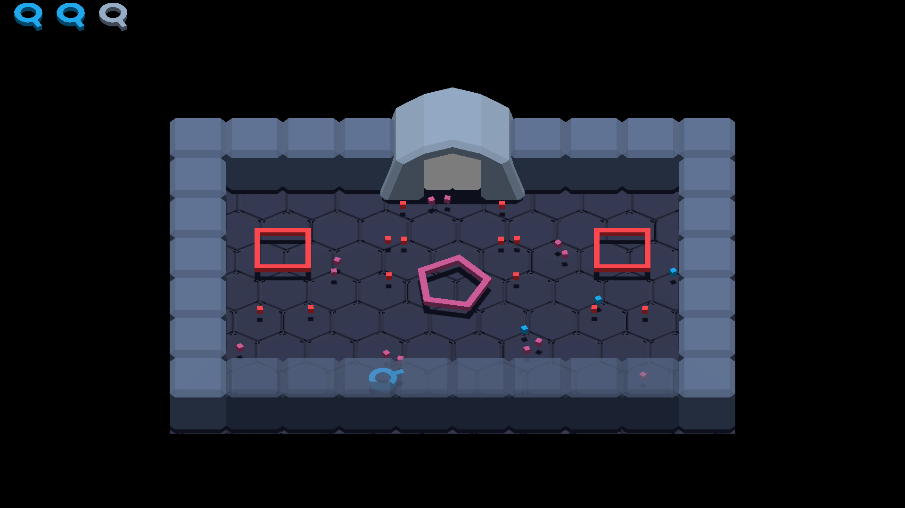

# Polygon Space

A game made during [Ludum Dare
#54](https://ldjam.com/events/ludum-dare/54/polygon-space), for the theme
_Limited Space_.

A bullet-hell style game where each level has less and less space available,
making movement harder.

Move with WASD or arrow keys, shoot with LMB.

**The [web export](https://kwarf.itch.io/polygon-space) does not have shadows**,
and the nearest wall will not be transparent, other than that it should work,
but for the best experience, download [one of the native
builds](https://github.com/Kwarf/ld54/releases).

### Things that didn't make it

Some ideas I had planned for was the ability to pick up shapes and inherit their
bullet patterns, boss fights, and different sized doors that would prevent you
to carry certain shapes with you, but I did not have the time or energy to add
any of that.
